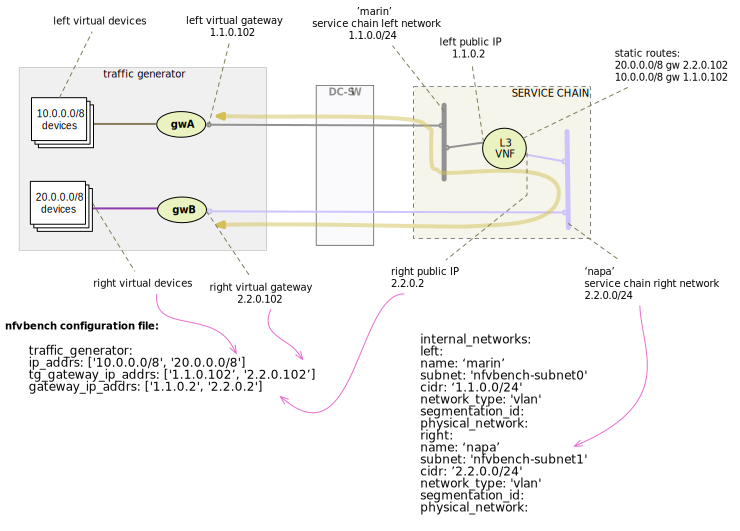

.. This work is licensed under a Creative Commons Attribution 4.0 International License.
.. SPDX-License-Identifier: CC-BY-4.0
.. (c) Cisco Systems, Inc

==============
Advanced Usage
==============

This section covers a few examples on how to run NFVbench with multiple different settings.
Below are shown the most common and useful use-cases and explained some fields from a default config file.

How to change any NFVbench run configuration (CLI)
--------------------------------------------------
NFVbench always starts with a default configuration which can further be partially refined (overridden) by the user from the CLI or from REST requests.

At first have a look at the default config:

.. code-block:: bash

    nfvbench --show-default-config

It is sometimes useful derive your own configuration from a copy of the default config:

.. code-block:: bash

    nfvbench --show-default-config > nfvbench.cfg

At this point you can edit the copy by:

- removing any parameter that is not to be changed (since NFVbench will always load the default configuration, default values are not needed)
- edit the parameters that are to be changed changed

A run with the new confguration can then simply be requested using the -c option and by using the actual path of the configuration file
as seen from inside the container (in this example, we assume the current directory is mapped to /tmp/nfvbench in the container):

.. code-block:: bash

    nfvbench -c /tmp/nfvbench/nfvbench.cfg

The same -c option also accepts any valid yaml or json string to override certain parameters without having to create a configuration file.

NFVbench also provides many configuration options as optional arguments. For example the number of flows can be specified using the --flow-count option.

For example, flow count can be specified in any of 3 ways:

- by providing a confguration file that has the flow_count value to use (-c myconfig.yaml and myconfig.yaml contains 'flow_count: 100k')
- by passing that yaml paremeter inline (-c "flow_count: 100k") or (-c "{flow_count: 100k}")
- by using the flow count optional argument (--flow-count 100k)

Showing the running configuration
---------------------------------

Because configuration parameters can be overriden, it is sometimes useful to show the final configuration (after all oevrrides are done) by using the --show-config option.
This final configuration is also called the "running" configuration.

For example, this will only display the running configuration (without actually running anything):

.. code-block:: bash

    nfvbench -c "{flow_count: 100k, debug: true}" --show-config

Connectivity and Configuration Check
------------------------------------

NFVbench allows to test connectivity to devices used with selected flow test, for example PVP.
It runs the whole test, but without actually sending any traffic or influencing interface counters.
It is also a good way to check if everything is configured properly in the config file and what versions of components are used.

To verify everything works without sending any traffic, use the --no-traffic option:

.. code-block:: bash

    nfvbench --no-traffic

Used parameters:

* ``--no-traffic`` or ``-0`` : sending traffic from traffic generator is skipped

Fixed Rate Run
--------------

Fixed rate run is the most basic type of NFVbench usage. It is usually used to verify that some amount of packets can pass network components in selected flow.

The first example shows how to run PVP flow (default flow) with multiple different settings:

.. code-block:: bash

    nfvbench -c nfvbench.cfg --no-reset --no-cleanup --rate 100000pps --duration 30 --interval 15 --json results.json

Used parameters:

* ``-c nfvbench.cfg`` : path to the config file
* ``--no-cleanup`` : resources (networks, VMs, attached ports) are not deleted after test is finished
* ``--rate 100000pps`` : defines rate of packets sent by traffic generator
* ``--duration 30`` : specifies how long should traffic be running in seconds
* ``--interval 15`` : stats are checked and shown periodically (in seconds) in this interval when traffic is flowing
* ``--json results.json`` : collected data are stored in this file after run is finished

.. note:: It is your responsibility to clean up resources if needed when ``--no-cleanup`` parameter is used.

The ``--json`` parameter makes it easy to store NFVbench results. To display collected results in a table form, do:

.. code-block:: bash

    nfvbench --show-summary results.json    # or shortcut -ss results.json

Second example aims to show how to specify which supported flow to run:

.. code-block:: bash

    nfvbench -c nfvbench.cfg --rate 1Mbps --inter-node --service-chain PVVP

Used parameters:

* ``-c nfvbench.cfg`` : path to the config file
* ``--rate 1Mbps`` : defines rate of packets sent by traffic generator
* ``--inter-node`` : VMs are created on different compute nodes, works only with PVVP flow
* ``--service-chain PVVP`` or ``-sc PVVP`` : specifies type of flow to use, default is PVP

.. note:: When parameter ``--inter-node`` is not used or there aren't enough compute nodes, VMs are on the same compute node.

Rate Units
^^^^^^^^^^

Parameter ``--rate`` accepts different types of values:

* packets per second (pps, kpps, mpps), e.g. ``1000pps`` or ``10kpps``
* load percentage (%), e.g. ``50%``
* bits per second (bps, kbps, Mbps, Gbps), e.g. ``1Gbps``, ``1000bps``
* NDR/PDR (ndr, pdr, ndr_pdr), e.g. ``ndr_pdr``

The last mentioned value, NDR/PDR, is default one and its usage is covered more below.

NDR and PDR
-----------

NDR and PDR test is used to determine performance of your setup, maximum packets throughput.

* NDR (No Drop Rate): how many packets can be sent so (almost) none of them are dropped
* PDR (Partial Drop Rate): how many packets can be sent so drop rate is below given limit

Config file contains section where settings for NDR/PDR can be set.
Increasing number of attempts helps to minimize a chance of traffic hiccups influencing result.
Other way of increasing precision is to specify longer duration for traffic to run.

.. code-block:: bash

    # NDR/PDR configuration
    measurement:
        # Drop rates represent the ratio of dropped packet to the total number of packets sent.
        # Values provided here are percentages. A value of 0.01 means that at most 0.01% of all
        # packets sent are dropped (or 1 packet every 10,000 packets sent)

        # No Drop Rate; Default to 0.001%
        NDR: 0.001
        # Partial Drop Rate; NDR should always be less than PDR
        PDR: 0.1
        # The accuracy of NDR and PDR load percentiles; The actual load percentile that match NDR
        # or PDR should be within `load_epsilon` difference than the one calculated.
        load_epsilon: 0.1

Because NDR/PDR is the default ``--rate`` value, it's possible to run NFVbench simply like this:

.. code-block:: bash

    nfvbench -c nfvbench.cfg

Other custom run:

.. code-block:: bash

    nfvbench -c nfvbench.cfg --duration 120 --json results.json

Used parameters:

* ``-c nfvbench.cfg`` : path to the config file
* ``--duration 120`` : specifies how long should be traffic running in each iteration
* ``--json results.json`` : collected data are stored in this file after run is finished

Multichain
----------

NFVbench allows to run multiple chains at the same time. For example it is possible to run PVP service chain N-times,
where N can be as much as your compute power can scale. With N = 10, NFVbench will spawn 10 VMs as a part of 10 simultaneous PVP chains.

Number of chains is specified by ``--service-chain-count`` or ``-scc`` flag, default value is 1.
For example to run NFVbench with 3 PVP chains use command:

.. code-block:: bash

    nfvbench -c nfvbench.cfg --rate 10000pps -scc 3

It is not necessary to specify service chain because PVP is set as default. PVP service chains will have 3 VMs in 3 chains with this configuration.
If ``-sc PVVP`` is specified instead, there would be 6 VMs in 3 chains as this service chain has 2 VMs per chain.
Both **single run** or **NDR/PDR** can be run as multichain. Running multichain is a scenario closer to a real life situation than just simple run.

External Chain
--------------

NFVbench can measure the performance of 1 or more L3 service chains that are setup externally. Instead of being setup by NFVbench,
the complete environment (VMs and networks) has to be setup prior to running NFVbench.

Each external chain is made of 1 or more VNFs and has exactly 2 end network interfaces (left and right network interfaces) that are connected to 2 neutron networks (left and right networks).
The internal composition of a multi-VNF service chain can be arbitrary (usually linear) as far as NFVbench is concerned,
the only requirement is that the service chain can route L3 packets properly between the left and right networks.

To run NFVbench on such external service chains:

- explicitly tell NFVbench to use external service chain by adding ``-sc EXT`` or ``--service-chain EXT`` to NFVbench CLI options
- specify the number of external chains using the ``-scc`` option (defaults to 1 chain)
- specify the 2 end point networks of your environment in ``external_networks`` inside the config file.
    - The two networks specified there have to exist in Neutron and will be used as the end point networks by NFVbench ('napa' and 'marin' in the diagram below)
- specify the router gateway IPs for the external service chains (1.1.0.2 and 2.2.0.2)
- specify the traffic generator gateway IPs for the external service chains (1.1.0.102 and 2.2.0.102 in diagram below)
- specify the packet source and destination IPs for the virtual devices that are simulated (10.0.0.0/8 and 20.0.0.0/8)

The L3 router function must be enabled in the VNF and configured to:

- reply to ARP requests to its public IP addresses on both left and right networks
- route packets from each set of remote devices toward the appropriate dest gateway IP in the traffic generator using 2 static routes (as illustrated in the diagram)

Upon start, NFVbench will 
- first retrieve the properties of the left and right networks using Neutron APIs,
- extract the underlying network ID (either VLAN ID or VNI if VxLAN is used),
- then program the TOR to stitch the 2 interfaces from the traffic generator into each end of the service chain,
- then generate and measure traffic.

Note that in the case of multiple chains, all chains end interfaces must be connected to the same two left and right networks.
The traffic will be load balanced across the corresponding gateway IP of these external service chains.

.. note:: By default, interfaces configuration (TOR, VTS, etc.) will be run by NFVbench but these can be skipped by using ``--no-int-config`` flag.

Multiflow
---------

NFVbench always generates L3 packets from the traffic generator but allows the user to specify how many flows to generate.
A flow is identified by a unique src/dest MAC IP and port tuple that is sent by the traffic generator. Note that from a vswitch point of view, the
number of flows seen will be higher as it will be at least 4 times the number of flows sent by the traffic generator
(add reverse direction of vswitch to traffic generator, add flow to VM and flow from VM).

The number of flows will be spread roughly even between chains when more than 1 chain is being tested.
For example, for 11 flows and 3 chains, number of flows that will run for each chain will be 3, 4, and 4 flows respectively.

The number of flows is specified by ``--flow-count`` or ``-fc`` flag, the default value is 2 (1 flow in each direction).
To run NFVbench with 3 chains and 100 flows, use the following command:

.. code-block:: bash

    nfvbench -c nfvbench.cfg --rate 10000pps -scc 3 -fc 100

IP addresses generated can be controlled with the following NFVbench configuration options:

.. code-block:: bash

    ip_addrs: ['10.0.0.0/8', '20.0.0.0/8']
    ip_addrs_step: 0.0.0.1
    tg_gateway_ip_addrs: ['1.1.0.100', '2.2.0.100']
    tg_gateway_ip_addrs_step: 0.0.0.1
    gateway_ip_addrs: ['1.1.0.2', '2.2.0.2']
    gateway_ip_addrs_step: 0.0.0.1

``ip_addrs`` are the start of the 2 ip address ranges used by the traffic generators as the packets source and destination packets
where each range is associated to virtual devices simulated behind 1 physical interface of the traffic generator.
These can also be written in CIDR notation to represent the subnet.

``tg_gateway_ip_addrs`` are the traffic generator gateway (virtual) ip addresses, all traffic to/from the virtual devices go through them.

``gateway_ip_addrs`` are the 2 gateway ip address ranges of the VMs used in the external chains. They are only used with external chains and must correspond to their public IP address.

The corresponding ``step`` is used for ranging the IP addresses from the `ip_addrs``, ``tg_gateway_ip_addrs`` and ``gateway_ip_addrs`` base addresses.
0.0.0.1 is the default step for all IP ranges. In ``ip_addrs``, 'random' can be configured which tells NFVBench to generate random src/dst IP pairs in the traffic stream.

Traffic Config via CLI
----------------------

While traffic configuration can modified using the config file, it became a hassle to have to change the config file everytime you need to change traffic config.

Traffic config can be overridden with the CLI options.

Here is an example of configuring traffic via CLI:

.. code-block:: bash

    nfvbench --rate 10kpps --service-chain-count 2 -fs 64 -fs IMIX -fs 1518 --unidir

This command will run NFVbench with two streams with unidirectional flow for three packet sizes 64B, IMIX, and 1518B.

Used parameters:

* ``--rate 10kpps`` : defines rate of packets sent by traffic generator (total TX rate)
* ``-scc 2`` or ``--service-chain-count 2`` : specifies number of parallel chains of given flow to run (default to 1)
* ``-fs 64`` or ``--frame-size 64``: add the specified frame size to the list of frame sizes to run
* ``--unidir`` : run traffic with unidirectional flow (default to bidirectional flow)

MAC Addresses
-------------

NFVbench will dicover the MAC addresses to use for generated frames using:
- either OpenStack discovery (find the MAC of an existing VM) if the loopback VM is configured to run L2 forwarding 
- or using dynamic ARP discovery (find MAC from IP) if the loopback VM is configured to run L3 routing or in the case of external chains.

