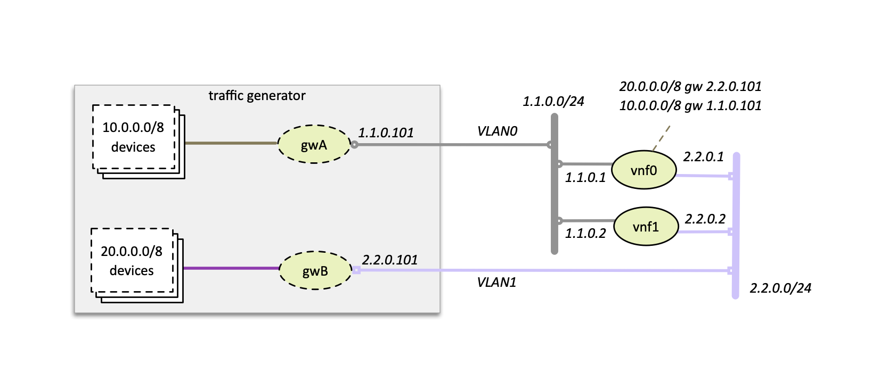
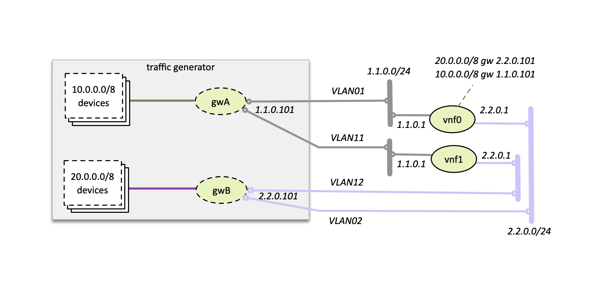

.. This work is licensed under a Creative Commons Attribution 4.0 International License.
.. SPDX-License-Identifier: CC-BY-4.0
.. (c) Cisco Systems, Inc

===============
External Chains
===============

NFVbench can measure the performance of 1 or more L3 service chains that are setup externally using OpenStack or without OpenStack.
Instead of being setup by NFVbench, the complete environment (VNFs and networks) must be setup prior to running NFVbench.

Each external chain is made of 1 or more VNFs and has exactly 2 edge network interfaces (left and right network interfaces)
that are connected to 2 edge networks (left and right networks).
The 2 edge networks for each chain can either be shared across all chains or can be independent.

The internal composition of a multi-VNF service chain can be arbitrary (usually linear) as far as NFVbench is concerned,
the only requirement is that the service chain can route L3 packets properly between the left and right networks.

The network topology of the service chains is defined by the "service_chain_shared_net" option in the
NFVbench configuration file.

Shared Edge Networks
--------------------

This option is defined when "service_chain_shared_net" is set to true.
All chains must share the same 2 edge networks and the VNF gateway IP addresses on each edge
must all belong to the same subnet.

The main advantage of this mode is that only 2 network segments are needed to support an arbitrary number of chains.

Multi-VLAN Edge Networks
------------------------

This option is defined when "service_chain_shared_net" is set to false (default).
Each chain has its own dedicated left and right network and there is no inter-chain constraint
on the VNF IP addresses since they all belong to different network segments.

The advantage of this mode is that the configuration of the VNFs can be made identical (same
gateway IP addresses, same static routes).
However this mode requires 2 network segments per chain.

Detailed Example
----------------
To run NFVbench on an external service chains using shared edge networks:

- tell NFVbench to use external service chain by adding "-sc EXT" or "--service-chain EXT" to NFVbench CLI options
- specify the number of external chains using the "-scc" option (defaults to 1 chain)
- if OpenStack is used:
    - specify the name of the 2 edge networks in "external_networks" in the NFVbench configuration file
    - The two networks specified have to exist in Neutron ('napa' and 'marin' in the diagram below)
- if OpenStack is not used:
    - specify the VLAN id to use for the 2 edge networks in "vlans" in the NFVbench configuration file
- specify the VNF gateway IPs for the external service chains (1.1.0.2 and 2.2.0.2)
- specify the traffic generator gateway IPs for the external service chains (1.1.0.102 and 2.2.0.102 in diagram below)
- specify the packet source and destination IPs for the virtual devices that are simulated (10.0.0.0/8 and 20.0.0.0/8)

.. image:: images/extchain-config.png

L3 routing must be enabled in the VNF and configured to:

- reply to ARP requests to its public IP addresses on both left and right networks
- route packets from each set of remote devices toward the appropriate dest gateway IP in the traffic generator using 2 static routes (as illustrated in the diagram)

Upon start, NFVbench will:
- first retrieve the properties of the left and right networks using Neutron APIs,
- extract the underlying network ID (typically VLAN segmentation ID),
- generate packets with the proper VLAN ID and measure traffic.

Note that in the case of multiple chains, all chains end interfaces must be connected to the same two left and right networks.
The traffic will be load balanced across the corresponding gateway IP of these external service chains.
