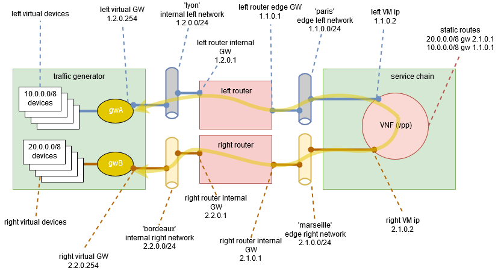

.. This work is licensed under a Creative Commons Attribution 4.0 International License.
.. SPDX-License-Identifier: CC-BY-4.0
.. (c) Cisco Systems, Inc

PVP L3 Router Internal Chain
----------------------------

NFVbench can measure the performance of 1 L3 service chain that are setup by NFVbench (VMs, routers and networks).

PVP L3 router chain is made of 1 VNF (in vpp mode) and has exactly 2 end network interfaces (left and right internal network interfaces) that are connected to 2 neutron routers with 2 edge networks (left and right edge networks).
The PVP L3 router service chain can route L3 packets properly between the left and right networks.

To run NFVbench on such PVP L3 router service chain:

- explicitly tell NFVbench to use PVP service chain with L3 router option by adding ``-l3`` or ``--l3-router`` to NFVbench CLI options or ``l3_router: true`` in config
- explicitly tell NFVbench to use VPP forwarder with ``vm_forwarder: vpp`` in config
- specify the 2 end point networks (networks between NFVBench and neutron routers) of your environment in ``internal_networks`` inside the config file.
    - The two networks specified will be created if not existing in Neutron and will be used as the end point networks by NFVbench ('lyon' and 'bordeaux' in the diagram below)
- specify the 2 edge networks (networks between neutron routers and loopback VM) of your environment in ``edge_networks`` inside the config file.
    - The two networks specified will be created if not existing in Neutron and will be used as the router gateway networks by NFVbench ('paris' and 'marseille' in the diagram below)
- specify the router gateway IPs for the PVPL3 router service chain (1.2.0.1 and 2.2.0.1)
- specify the traffic generator gateway IPs for the PVPL3 router service chain (1.2.0.254 and 2.2.0.254 in diagram below)
- specify the packet source and destination IPs for the virtual devices that are simulated (10.0.0.0/8 and 20.0.0.0/8)

nfvbench configuration file:

.. code-block:: bash

    vm_forwarder: vpp

    traffic_generator:
        ip_addrs: ['10.0.0.0/8', '20.0.0.0/8']
        tg_gateway_ip_addrs: ['1.2.0.254', '2.2.0.254']
        gateway_ip_addrs: ['1.2.0.1', '2.2.0.1']

    internal_networks:
        left:
            name: 'lyon'
            cidr: '1.2.0.0/24'
            gateway: '1.2.0.1'
        right:
            name: 'bordeaux'
            cidr: '2.2.0.0/24'
            gateway: '2.2.0.1'

    edge_networks:
        left:
            name: 'paris'
            cidr: '1.1.0.0/24'
            gateway: '1.1.0.1'
        right:
            name: 'marseille'
            cidr: '2.1.0.0/24'
            gateway: '2.1.0.1'

Upon start, NFVbench will:
- first retrieve the properties of the left and right networks using Neutron APIs,
- extract the underlying network ID (typically VLAN segmentation ID),
- generate packets with the proper VLAN ID and measure traffic.

Please note: ``l3_router`` option is also compatible with external routers. In this case NFVBench will use ``EXT`` chain.
