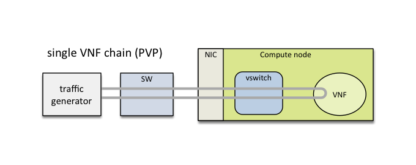
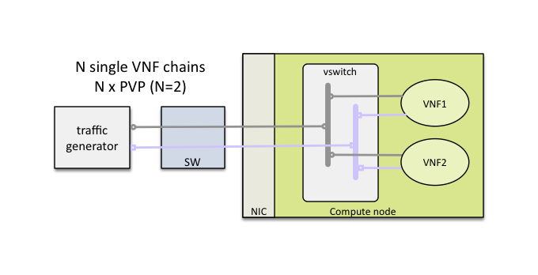
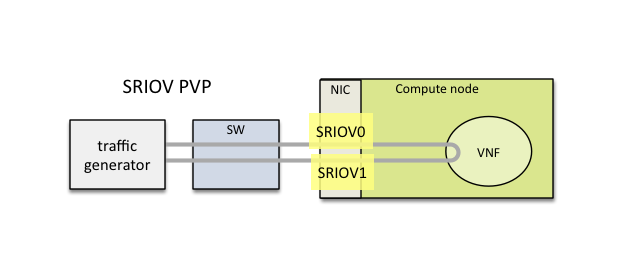
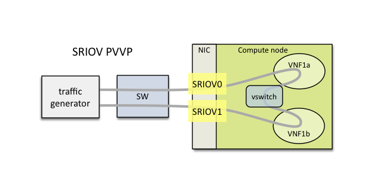
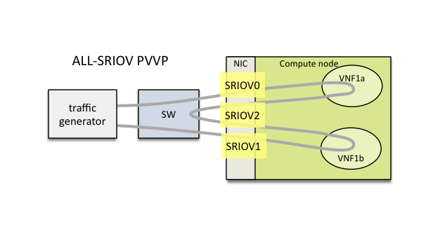

.. This work is licensed under a Creative Commons Attribution 4.0 International License.
.. SPDX-License-Identifier: CC-BY-4.0
.. (c) Cisco Systems, Inc

NFVbench: A Network Performance Benchmarking Tool for NFVi Full Stacks
**********************************************************************

The NFVbench tool provides an automated way to measure the network performance for the most common data plane packet flows
on any NFVi system viewed as a black box (NFVi Full Stack).
An NFVi full stack exposes the following interfaces:
- an OpenStack API for those NFVi platforms based on OpenStack
- an interface to send and receive packets on the data plane (typically through top of rack switches while simpler direct wiring to a looping device would also work)

The NFVi full stack can be any functional OpenStack system that provides the above interfaces.
NFVbench can also be used without OpenStack on any networking device that can handle L2 forwarding or L3 routing.

NFVbench can be installed standalone (in the form of a single Docker container) and is fully functional without
the need to install any other OPNFV tool.

It is designed to be easy to install and easy to use by non experts (no need to be an expert in traffic generators and data plane
performance benchmarking). NFVbench integrates with the open source traffic generator TRex and provides the following benefits when compared
to using a traffic generator directly:

- yaml configuration driven benchmark runs
- CLI or REST front end
- finds highest throughput based on drop rate requirement using an optimized binary search with very fast convergence time
- supports multi-chaining or dense VNF throughput measurement (e.g. find the throughput of a compute node running 20 loopback VNFs)
- detailed stats itemized per VNF chain in text or JSON format
- takes care of configuring packet flows and streams (often hard to use and specific to each gtraffic generator)
- takes care of bring up loopback VNFs/chains using Nova/Neutron/Glance OpenStack APIs
- saves you the hassle of searching what to measure, how to measure and how to interpret resuls

Data Plane Performance Measurement Features
-------------------------------------------

NFVbench supports the following main measurement capabilities:

- supports 2 measurement modes:
    - *fixed rate* mode to generate traffic at a fixed rate for a fixed duration
    - NDR (No Drop Rate) and PDR (Partial Drop Rate) measurement mode
- configurable frame sizes (any list of fixed sizes or 'IMIX')
- built-in packet paths (PVP, PVVP)
- built-in loopback VNFs based on fast L2 or L3 forwarders running in VMs
- configurable number of flows and service chains
- configurable traffic direction (single or bi-directional)
- can support optional VLAN tagging (dot1q) or VxLAN overlays

NDR is the highest throughput achieved without dropping packets.
PDR is the highest throughput achieved without dropping more than a pre-set limit (called PDR threshold or allowance, expressed in %).

Results of each run include the following data:

- Aggregated achieved bit rate throughput in bps
- Aggregated achieved packet rate in pps (or fps)
- Actual drop rate in %
- Latency in usec (min, max, average in the current version)

Built-in OpenStack support (optional)
-------------------------------------
NFVbench can optionally stage OpenStack resources to build 1 or more service chains using direct OpenStack APIs. Each service chain is composed of:

- 1 or 2 loopback VM instances per service chain
- 2 Neutron networks per loopback VM

OpenStack resources are staged before traffic is measured using OpenStack APIs (Nova and Neutron) then disposed after completion of measurements.

The loopback VM flavor to use can be configured in the NFVbench configuration file.

Note that NFVbench does not use OpenStack Heat nor any higher level service (VNFM or NFVO) to create the service chains because its
main purpose is to measure the performance of the NFVi infrastructure which is mainly focused on L2 forwarding performance.

External Chains
---------------
NFVbench supports settings that involve externally staged packet paths with or without OpenStack:

- run benchmarks on existing service chains at the L3 level that are staged externally by any other tool (e.g. any VNF capable of L3 routing)
- run benchmarks on existing L2 chains that are configured externally (e.g. pure L2 forwarder such as DPDK testpmd)

Direct L2 Loopback (Switch or wire loopback)
--------------------------------------------
NFVbench supports benchmarking of pure L2 loopbacks (see "--l2-loopback vlan" option)

- Switch level loopback
- Port to port wire loopback

In this mode, NFVbench will take a vlan ID and send packets from each port to the other port
(dest MAC set to the other port MAC) using the same VLAN ID on both ports.
This can be useful for example to verify that the connectivity to the switch is working properly.

Traffic Generation
------------------

NFVbench currently integrates with the open source TRex traffic generator:

- `TRex <https://trex-tgn.cisco.com>`_ (pre-built into the NFVbench container)

Supported Packet Paths
----------------------
Packet paths describe where packets are flowing in the NFVi platform. The most commonly used paths are identified by 3 or 4 letter abbreviations.
A packet path can generally describe the flow of packets associated to one or more service chains, with each service chain composed of 1 or more VNFs.

The following packet paths are currently supported by NFVbench:

- PVP (Physical interface to VM to Physical interface)
- PVVP (Physical interface to VM to VM to Physical interface)
- N*PVP (N concurrent PVP packet paths)
- N*PVVP (N concurrent PVVP packet paths)

The traffic is made of 1 or more flows of L3 frames (UDP packets) with different payload sizes. Each flow is identified by a unique source and destination MAC/IP tuple.

Loopback VM
^^^^^^^^^^^

NFVbench provides a loopback VM image that runs CentOS with 2 pre-installed forwarders:

- DPDK testpmd configured to do L2 cross connect between 2 virtual interfaces
- FD.io VPP configured to perform L3 routing between 2 virtual interfaces

Frames are just forwarded from one interface to the other.
In the case of testpmd, the source and destination MAC are rewritten, which corresponds to the mac forwarding mode (--forward-mode=mac).
In the case of VPP, VPP will act as a real L3 router, and the packets are routed from one port to the other using static routes.

Which forwarder and what Nova flavor to use can be selected in the NFVbench configuration. Be default the DPDK testpmd forwarder is used with 2 vCPU per VM.
The configuration of these forwarders (such as MAC rewrite configuration or static route configuration) is managed by NFVbench.

Importance of Dense VNF Measurement
-----------------------------------
Production deployments of NFVi stacks can require to run a large number of VMs per compute node in order to fully utilize all the
hardware resources available in each of these compute nodes.
Given that optimization of a compute node can be very different based on the number of VMs, it is therefore critical
to do performance benchmarking at scale.
NFVbench has been the first benchmarking tool to recognize this and to provide dense VNF dataplane benchmarking
by staging multipe chains using OpenStack and configuring the traffic generator to split the traffic
across all configured chains. This kind of measurement is very time consuming to do directly with traffic generators
as it requires understanding how traffic is shaped in order to cover all chains in a balanced way.

PVP Packet Path
^^^^^^^^^^^^^^^

This packet path represents a single service chain with 1 loopback VNF and 2 Neutron networks:

PVVP Packet Path
^^^^^^^^^^^^^^^^

This packet path represents a single service chain with 2 loopback VNFs in sequence and 3 Neutron networks.
The 2 VNFs will only run on the same compute node (PVVP intra-node):

.. image:: images/nfvbench-pvvp.png

Dense VNF or Multi-Chaining (N*PVP or N*PVVP)
^^^^^^^^^^^^^^^^^^^^^^^^^^^^^^^^^^^^^^^^^^^^^

Multiple service chains can be setup by NFVbench without any limit on the concurrency (other than limits imposed by available resources on compute nodes).
In the case of multiple service chains, NFVbench will instruct the traffic generator to use multiple L3 packet streams (frames directed to each path will
have a unique destination MAC address).

Example of multi-chaining with 2 concurrent PVP service chains:

This innovative feature will allow to measure easily the performance of a fully loaded compute node running multiple service chains.

Multi-chaining is currently limited to 1 compute node (VMs run on the same compute node).
The 2 edge interfaces for all service chains can either share the same 2 networks or can use
dedicated networks (based on a configuration option).
The total traffic will be split equally across all chains.

SR-IOV
^^^^^^

By default, service chains will be based on virtual switch interfaces.

NFVbench provides an option to select SR-IOV based virtual interfaces instead (thus bypassing any virtual switch) for those OpenStack system that include and support SR-IOV capable NICs on compute nodes.

The PVP packet path will bypass the virtual switch completely when the SR-IOV option is selected:

The PVVP packet path will use SR-IOV for the left and right networks and the virtual switch for the middle network by default:

This packet path is a good way to approximate VM to VM (V2V) performance (middle network) given the high efficiency of the left and right networks. The V2V throughput will likely be very close to the PVVP throughput while its latency will be very close to the difference between the SR-IOV PVVP latency and the SR-IOV PVP latency.

It is possible to also force the middle network to use SR-IOV (in this version, the middle network is limited to use the same SR-IOV phys net):

Other Misc Packet Paths
^^^^^^^^^^^^^^^^^^^^^^^

P2P (Physical interface to Physical interface - no VM) can be supported using the external chain/L2 forwarding mode.

V2V (VM to VM) is not supported but PVVP provides a more complete (and more realistic) alternative.

PVP chain with L3 routers in the path can be supported using PVP chain with L3 forwarding mode (l3_router option). See PVP L3 Router Internal Chain section for more details.

Supported Neutron Network Plugins and vswitches
-----------------------------------------------

Any Virtual Switch, Any Encapsulation
^^^^^^^^^^^^^^^^^^^^^^^^^^^^^^^^^^^^^

NFVbench is agnostic of the virtual switch implementation and has been tested with the following virtual switches:

- ML2/VPP/VLAN (networking-vpp)
- OVS/VLAN and OVS-DPDK/VLAN
- ML2/ODL/VPP (OPNFV Fast Data Stack)

Limitations
***********
VxLAN: latency measurement is not available in the current VxLAN release
PVVP Inter-node (where the 2 VMs are running on diofferent compute nodes) is no longer supported
