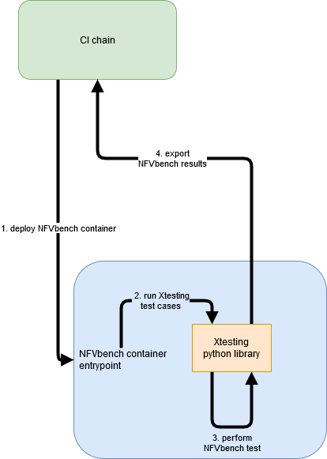

.. This work is licensed under a Creative Commons Attribution 4.0 International License.
.. SPDX-License-Identifier: CC-BY-4.0

NFVbench Xtesting test cases and Xtesting CI integration
--------------------------------------------------------

NFVbench can leverages on `Xtesting CI <https://galaxy.ansible.com/collivier/xtesting>`_ and the common test case execution proposed by `Xtesting <https://xtesting.readthedocs.io/en/latest/>`_.
Thanks to a simple test case list, this tool deploys anywhere plug-and-play `CI/CD toolchains in a few commands <https://wiki.opnfv.org/pages/viewpage.action?pageId=32015004>`_.
In addition, it supports multiple components such as Jenkins and Gitlab CI (test schedulers) and multiple deployment models such as all-in-one or centralized services.

NFVbench using Xtesting and Xtesting CI will permit:

- smoothly assemble multiple heterogeneous test cases
- generate the Jenkins jobs
- deploy local CI/CD toolchains everywhere
- dump all test case results and logs for third-party conformance review

Xtesting CI only requires GNU/Linux as Operating System and asks for a few dependencies as described in Deploy your own Xtesting CI/CD toolchains:

- python-virtualenv
- docker.io
- git

Please note the next two points depending on the GNU/Linux distributions and the network settings:

- SELinux: you may have to add --system-site-packages when creating the virtualenv ("Aborting, target uses selinux but python bindings (libselinux-python) aren't installed!")
- Proxy: you may set your proxy in env for Ansible and in systemd for Docker https://docs.docker.com/config/daemon/systemd/#httphttps-proxy

Here is the default NFVbench tree as proposed in ``xtesting/ansible/host_vars/127.0.0.1`` file:

- ``/home/opnfv/nfvbench``

File content:

.. code-block:: bash

    docker_args:
    env: {}
    volumes:
      - /lib/modules/$(uname -r):/lib/modules/$(uname -r)
      - /usr/src/kernels:/usr/src/kernels -v /dev:/dev
      - /home/opnfv/nfvbench:/tmp/nfvbench

Please note: replace ``/home/opnfv/nfvbench`` with appropriate path to permit NFVbench container to access config file

To deploy your own CI toolchain running NFVbench:

.. code-block:: bash

    virtualenv nfvbench
    . nfvbench/bin/activate
    pip install ansible
    ansible-galaxy install collivier.xtesting
    git clone https://gerrit.opnfv.org/gerrit/nfvbench nfvbench
    ansible-playbook nfvbench/xtesting/ansible/site.yml

NFVbench Xtesting test cases and existing CI chain
--------------------------------------------------

For test automation purpose, Xtesting framework can be used as an executor of NFVbench test cases and called by a CI chain (Jenkins, Gitlab CI ...).
Xtesting use a testcases.yaml file to list and run test case. One basic testcases.yaml is provided by NFVbench natively but can be override.

Example of CI scenario:

1. Run NFVbench container using Xtesting python library

The NFVbench container can be started using docker run command.

To run NFVbench using docker run:

.. code-block:: bash

    docker run --rm \
        -e S3_ENDPOINT_URL=http://127.0.0.1:9000 \
        -e S3_DST_URL=s3://xtesting/$BUILD_TAG/$JOB_NAME-$BUILD_ID \
        -e HTTP_DST_URL=http://127.0.0.1:8181/$BUILD_TAG/$JOB_NAME-$BUILD_ID \
        -e AWS_ACCESS_KEY_ID=xtesting \
        -e AWS_SECRET_ACCESS_KEY=xtesting \
        -e TEST_DB_URL=http://127.0.0.1:8000/api/v1/results \
        -e NODE_NAME=nfvbench \
        -e BUILD_TAG=$BUILD_TAG \
        --privileged \
        -v /lib/modules/$(uname -r):/lib/modules/$(uname -r) \
        -v /usr/src/kernels:/usr/src/kernels -v /dev:/dev \
        -v $HOME/nfvbench:/tmp/nfvbench \
        -v $HOME/workspace/$JOB_NAME/results:/var/lib/xtesting/results \
        opnfv/nfvbench run_tests -t 10kpps-pvp-run -r -p

+---------------------------------------------------------------+----------------------------------------------------------------------------+
| Docker options                                                | Description                                                                |
+===============================================================+============================================================================+
| --rm                                                          | clean up container after execution                                         |
+---------------------------------------------------------------+----------------------------------------------------------------------------+
| -e S3_ENDPOINT_URL                                            | (Xtesting) Environnement variable used to store NFVbench artifacts to Minio|
+---------------------------------------------------------------+----------------------------------------------------------------------------+
| -e S3_DST_URL                                                 | (Xtesting) Environnement variable used for S3 storage destination          |
+---------------------------------------------------------------+----------------------------------------------------------------------------+
| -e HTTP_DST_URL                                               | (Xtesting) Environnement variable used for S3www service                   |
+---------------------------------------------------------------+----------------------------------------------------------------------------+
| -e AWS_ACCESS_KEY_ID                                          | (Xtesting) Environnement variable used for S3 access key                   |
+---------------------------------------------------------------+----------------------------------------------------------------------------+
| -e AWS_SECRET_ACCESS_KEY                                      | (Xtesting) Environnement variable used for S3 access secret                |
+---------------------------------------------------------------+----------------------------------------------------------------------------+
| -e TEST_DB_URL                                                | (Xtesting) Environnement variable used to export NFVbench results in DB    |
+---------------------------------------------------------------+----------------------------------------------------------------------------+
| -e NODE_NAME                                                  | (Xtesting) Environnement variable used as result key identifier in DB      |
+---------------------------------------------------------------+----------------------------------------------------------------------------+
| -e BUILD_TAG                                                  | (Xtesting) Environnement variable used as result key identifier in DB      |
+---------------------------------------------------------------+----------------------------------------------------------------------------+
| --privileged                                                  | (optional) required if SELinux is enabled on the host                      |
+---------------------------------------------------------------+----------------------------------------------------------------------------+
| -v /lib/modules:/lib/modules                                  | needed by kernel modules in the container                                  |
+---------------------------------------------------------------+----------------------------------------------------------------------------+
| -v /usr/src/kernels:/usr/src/kernels                          | needed by TRex to build kernel modules when needed                         |
+---------------------------------------------------------------+----------------------------------------------------------------------------+
| -v /dev:/dev                                                  | needed by kernel modules in the container                                  |
+---------------------------------------------------------------+----------------------------------------------------------------------------+
| -v $HOME/nfvbench:/tmp/nfvbench                               | folder mapping to pass files between the                                   |
|                                                               | host and the docker space (see examples below)                             |
|                                                               | Here we map the $HOME/nfvbench directory on the host                       |
|                                                               | to the /tmp/nfvbench director in the container.                            |
|                                                               | Any other mapping can work as well                                         |
+---------------------------------------------------------------+----------------------------------------------------------------------------+
| -v $HOME/workspace/$JOB_NAME/results:/var/lib/xtesting/results| (Xtesting) folder mapping to pass files between the                        |
|                                                               | CI chain workspace and the docker space to store Xtesting result files     |
|                                                               | in orchestrator (Jenkins, Gitlab ...)                                      |
+---------------------------------------------------------------+----------------------------------------------------------------------------+
| opnfv/nfvbench                                                | container image name                                                       |
+---------------------------------------------------------------+----------------------------------------------------------------------------+
| run_tests                                                     | (Xtesting) Xtesting command to run test cases                              |
+---------------------------------------------------------------+----------------------------------------------------------------------------+
| -t 10kpps-pvp-run                                             | (Xtesting) Xtesting parameter: Test case or tier (group of tests)          |
|                                                               | to be executed. It will run all the test if not specified.                 |
+---------------------------------------------------------------+----------------------------------------------------------------------------+
| -r                                                            | (Xtesting) Xtesting parameter: publish result to database                  |
+---------------------------------------------------------------+----------------------------------------------------------------------------+
| -p                                                            | (Xtesting) Xtesting parameter: publish artifacts to a S3 service           |
+---------------------------------------------------------------+----------------------------------------------------------------------------+

2. Run Xtesting test cases

Executed directly by NFVbench docker entrypoint after docker start.

3. Perform NFVbench test

Xtesting call NFVbench python script to execute test case scenario and wait for run to be terminated.

4. Export NFVbench result

If ``-r`` option is used, results are pushed to a DB through Xtesting.
If ``-p`` option is used, results are pushed to a S3 service through Xtesting.

Override testcases.yaml file
~~~~~~~~~~~~~~~~~~~~~~~~~~~~

To replace existing testcases.yaml file, using Xtesting CI add the volume mapping in ``xtesting/ansible/host_vars/127.0.0.1`` file:

.. code-block:: bash

    docker_args:
    env: {}
    volumes:
      - /lib/modules/$(uname -r):/lib/modules/$(uname -r)
      - /usr/src/kernels:/usr/src/kernels -v /dev:/dev
      - /home/opnfv/nfvbench:/tmp/nfvbench
      - /home/opnfv/nfvbench/xtesting/testcases.yaml:/usr/local/lib/python3.6/dist-packages/xtesting/ci/testcases.yaml

* ``/home/opnfv/nfvbench/xtesting/testcases.yaml:/usr/local/lib/python3.6/dist-packages/xtesting/ci/testcases.yaml`` : volume mapping to pass testcases.yaml file between the host and the docker space. Host path required testcases.yaml file inside.

To replace existing testcases.yaml file, using NFVbench container:

.. code-block:: bash

    docker run --name nfvbench --detach --privileged -v /lib/modules/$(uname -r):/lib/modules/$(uname -r) -v /usr/src/kernels:/usr/src/kernels -v /dev:/dev -v $HOME/nfvbench:/tmp/nfvbench \
    -v $HOME/nfvbench/xtesting/testcases.yaml:/usr/local/lib/python3.6/dist-packages/xtesting/ci/testcases.yaml \
    opnfv/nfvbench

* ``$HOME/nfvbench/xtesting/testcases.yaml:/usr/local/lib/python3.6/dist-packages/xtesting/ci/testcases.yaml`` : volume mapping to pass testcases.yaml file between the host and the docker space. Host path required testcases.yaml file inside.

Example of Xtesting test case
~~~~~~~~~~~~~~~~~~~~~~~~~~~~~

.. code-block:: bash

    ---
    tiers:
        -
            name: nfvbench
            order: 1
            description: 'Data Plane Performance Testing'
            testcases:
                -
                    case_name: 10kpps-pvp-run
                    project_name: nfvbench
                    criteria: 100
                    blocking: true
                    clean_flag: false
                    description: ''
                    run:
                        name: 'bashfeature'
                        args:
                            cmd:
                                - nfvbench -c /tmp/nfvbench/nfvbench.cfg --rate 10kpps

Examples of manual run
~~~~~~~~~~~~~~~~~~~~~~

If NFVbench container is already started in CLI mode (see Starting NFVbench in CLI mode dedicated chapter).
To do a single run at 10,000pps bi-directional (or 5kpps in each direction) using the PVP packet path:

.. code-block:: bash

   docker exec -it nfvbench run_tests -t 10kpps-pvp-run

Xtesting option used:

* ``-t 10kpps-pvp-run`` : specify the test case to run

To pass all test cases:

.. code-block:: bash

   docker exec -it nfvbench run_tests -t all

Xtesting option used:

* ``-t all`` : select all test cases existing in testcases.yaml file

