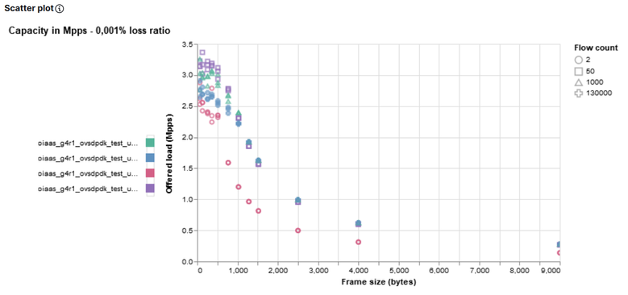
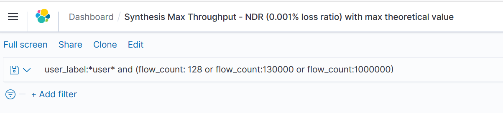
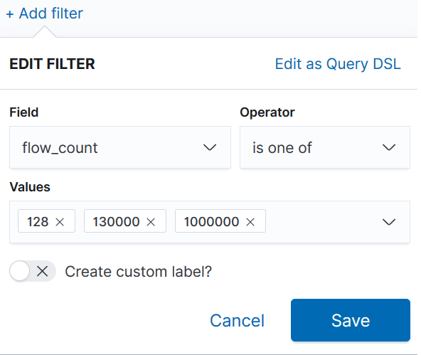

.. Copyright 2016 - 2023, Cisco Systems, Inc. and the NFVbench project contributors
.. SPDX-License-Identifier: CC-BY-4.0

NFVbench Kibana visualization: overview
=======================================

The fluentd integration offers the possibility to use elasticsearch and kibana as a visualization chain.

Chain overview:

.. image:: images/nfvbench-kibana.png

Example of NFVbench visualizations
----------------------------------

Kibana offers a lot of visualization type (line and bar charts, pie, time series chart, data table ...) and also provide a plugin to develop graph using Vega.
In the below examples, visualizations are based on an NDR result and are developed using `Vega-lite <https://vega.github.io/vega-lite-v2>`_.
Data are aggregated using ``user_label`` and ``flow_count`` properties.

In ``kibana/visualizations/`` pre-created graphs are available into json files.

For NDR capacity in Gbps using line chart, the offered load in Gbps (``offered_tx_rate_bps``) is used and only the maximum value of the aggregation is kept.
For NDR capacity in Mpps using line chart, the actual TX rate is used (``rate_pps``) and only the maximum value of the aggregation is kept.

Scatter plot graphs use the same values but keep all values instead of keeping maximum.

Example of a line chart:

.. image:: images/nfvbench-kibana-gbps-line.png

Example of a scatter plot chart:

Vega offers the possibility to add another graph as a new layer of current graph.
This solution is used to combine NFVbench results and theoretical line rate.
Using ``extra_encapsulation_bytes`` in --user-info property (see :ref:`user-info`),
the theoretical max value (for bps and pps) will be calculated and can be used in graph through ``theoretical_tx_rate_bps`` and ``theoretical_tx_rate_pps`` properties.

Example of chart with theoretical value (red line):

.. image:: images/nfvbench-kibana-pps-theoretical.png

Each Vega graph can be moved, zoomed (using mouse scroll) and one set of data can be selected.

Example:

.. image:: images/nfvbench-kibana-zoom-selection.png

These visualizations are included into Kibana dashboard for a synthesis of one set of result (i.e. same ``user_label`` value) or for comparison (i.e. a selection of ``user_label`` values).
See :ref:`filterkibana` for more details about ``user_label`` selection.

All these visualizations and dashboards are saved into the ``export.ndjson`` file and can be imported in an existing Kibana. See :ref:`importkibana`.

.. _importkibana:

Import Kibana dashboards and visualization
------------------------------------------

To import Kibana dashboard and visualization:

.. code-block:: bash

    curl -X POST localhost:5601/api/saved_objects/_import -H "kbn-xsrf: true" --form file=@export.ndjson

.. note:: ``.kibana`` index must exists in elasticsearch.
.. note:: ``.kibana`` index is created automatically after a first deployment and configuration of Kibana.

.. _filterkibana:

Kibana user guide: Filter dashboards and visualizations
=======================================================

Filter Kibana dashboard or visualization using Kibana query language (KQL)
--------------------------------------------------------------------------

.. code-block:: bash

    user_label:*demo* and (flow_count: 128 or flow_count:130000 or flow_count:1000000)

.. note:: This query will filter all user label which contains ``demo`` in the value and filter 3 flow count (128, 130k, 1M).
.. note:: ``flow_count`` is a number so KQL query can not contain formatted string.

Example:

Filter Kibana dashboard or visualization using Kibana filters
-------------------------------------------------------------

Kibana offers the possibility to add filter by selecting field and operator (is, is not, is one of, is not one of, exists, does not exist).

Example:

